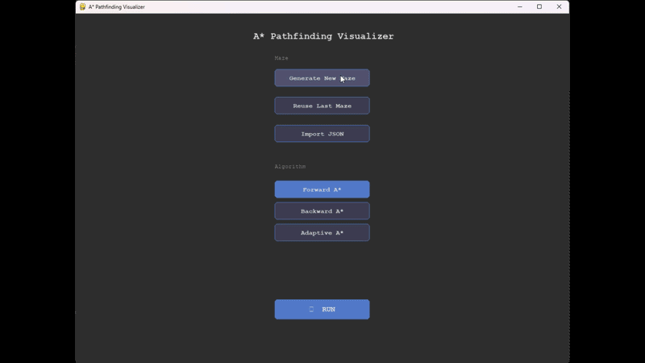
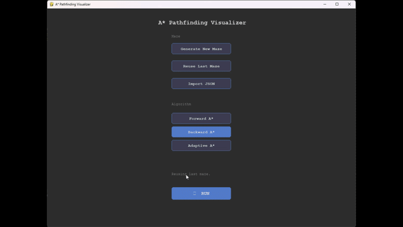

# A* Pathfinding Visualizer

An easy to follow step by step visualization of three A* variants navigating a randomly generated 101x101 maze. Built upon work and concepts from CS440 Intro to AI, visualization done with Pygame. Includes interactive elements like import/export maze as JSON, speed control and a pause button.

## Algorithms

- **Repeated Forward A*** — plans a path from the agent to the goal, moves until blocked, replans
- **Repeated Backward A*** — same but searches from goal toward agent each replan
- **Adaptive A*** — like forward, but updates heuristic values after each search using previously expanded cells

## Demo
---

**Basic UI and Forward A***



---

**Backward A***

---



## How To Run it

```bash
pip install -r requirements.txt
python3 visualize.py
```

## Controls

| Key | Action |
|-----|--------|
| ↑ / ↓ | Adjust speed |
| SPACE | Pause / resume |
| ESC | Back to menu |

## Color legend

| Color | Meaning |
|-------|---------|
| Green | Start |
| Purple | Goal |
| Yellow | Agent |
| Bright blue | Currently searching |
| Dark blue | Previously explored |
| Light maroon | Planned path |
| Dark maroon | Walked path |
| White | Blocked |
| Grey | Free |
